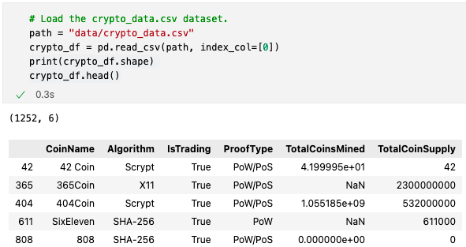
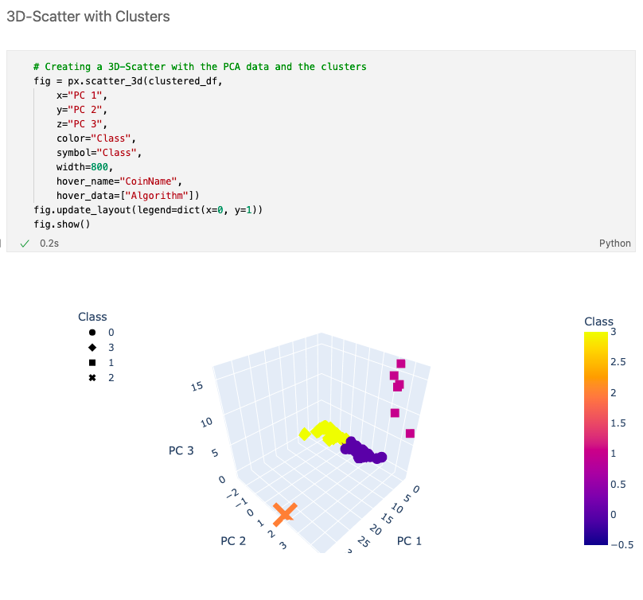
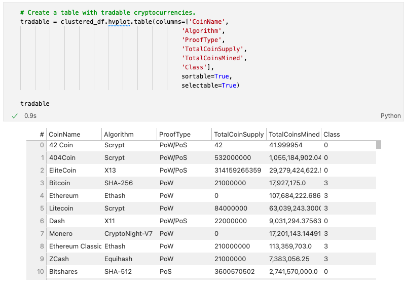
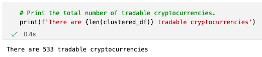
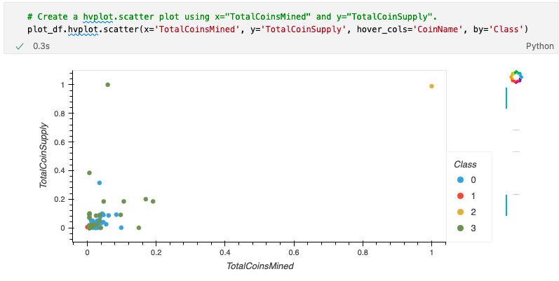

# Overview

The purpose of this project was to use unsupervised machine learning to create a report that includes what cryptocurrencies are on the trading market and how they could be grouped to create a classification system to guide investment.

The data itself was pulled from cryptocompare.com. The below is a preview of what the raw input looked like as a DataFrame:

The data was preprocessed, reduced using principal component analysis (PCA), clustered using K-Means, and visualized.

# Results

